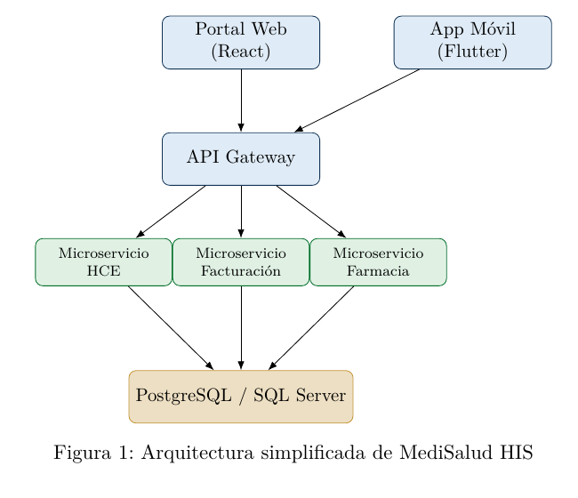
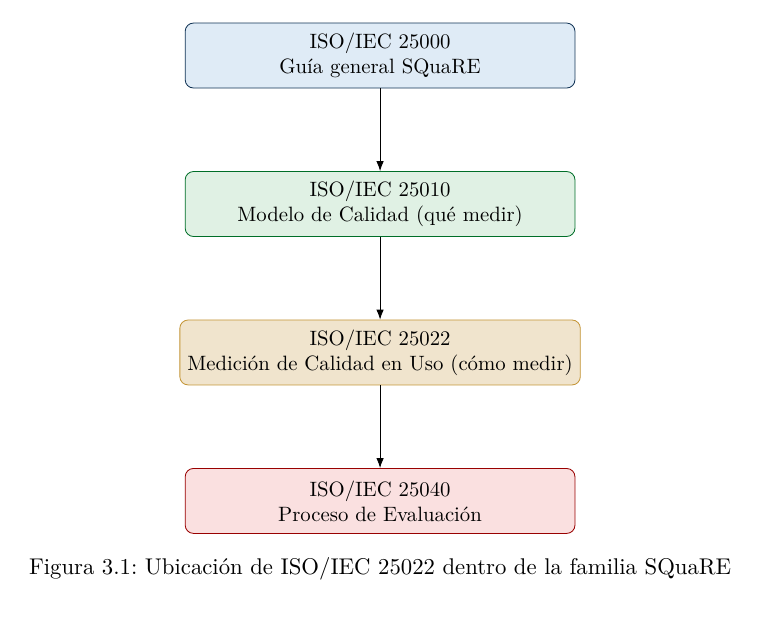

# Taller Guiado Integral

**Medición de la Calidad en Uso mediante ISO/IEC 25022**  
**Caso de estudio:** Sistema de Historia Clínica Electrónica  
**Red Hospitalaria MediSalud Ecuador**

**Asignatura:** Aseguramiento de la Calidad del Software  
**Marco de referencia:** ISO/IEC 25000 (SQuaRE)  
**Norma central:** ISO/IEC 25022 — Measurement of Quality in Use  
**Nivel:** Séptimo Semestre — Ingeniería en Sistemas / Ingeniería de Software  
**Modalidad:** Taller práctico basado en caso de estudio empresarial  
**Material:** Material didáctico para docentes universitarios  
**Versión:** 1.0

---

## Ficha Técnica del Material

| Campo | Descripción |
|---|---|
| Asignatura | Aseguramiento de la Calidad del Software |
| Unidad temática | Evaluación de la Calidad del Producto de Software — Modelo SQuaRE |
| Norma aplicada | ISO/IEC 25022:2016 — Measurement of Quality in Use |
| Dirigido a | Estudiantes de séptimo semestre de Ingeniería en Sistemas, Ingeniería de Software o carreras afines |
| Duración total sugerida | 12 sesiones de 3 horas (36 horas académicas) |
| Modalidad | Presencial / híbrida, con componente de laboratorio individual y grupal |
| Prerrequisitos | Fundamentos de bases de datos, programación en Python, nociones de ingeniería de software |
| Caso de estudio | Sistema de Historia Clínica Electrónica (HCE) de una red hospitalaria nacional |

---

## Índice general

- [Presentación General del Taller](#presentación-general-del-taller)
- [Caso de Estudio: Red Hospitalaria MediSalud Ecuador](#caso-de-estudio-red-hospitalaria-medisalud-ecuador)
- [Escenario 1: Introducción al Caso Empresarial](#escenario-1-introducción-al-caso-empresarial)
  - [1.1 Parte 1 — Fundamento Teórico](#11-parte-1--fundamento-teórico)
  - [1.2 Parte 2 — Actividad Práctica](#12-parte-2--actividad-práctica)
- [Escenario 2: Comprensión de ISO/IEC 25022](#escenario-2-comprensión-de-isoiec-25022)
  - [2.1 Parte 1 — Fundamento Teórico](#21-parte-1--fundamento-teórico)
  - [2.2 Parte 2 — Actividad Práctica](#22-parte-2--actividad-práctica)
- [Escenario 3: Comprensión del Modelo SQuaRE](#escenario-3-comprensión-del-modelo-square)
  - [3.1 Parte 1 — Fundamento Teórico](#31-parte-1--fundamento-teórico)
  - [3.2 Parte 2 — Actividad Práctica](#32-parte-2--actividad-práctica)

### Secciones listadas en el índice original del documento completo

El índice del PDF también menciona secciones posteriores del taller completo:

- 4. Identificación de Atributos de Calidad en Uso
- 5. Mapeo de Características de Calidad
- 6. Diseño de Métricas
- 7. Obtención de Datos
- 8. Automatización de la Medición
- 9. Construcción de Indicadores
- 10. Interpretación de Resultados
- 11. Presentación Ejecutiva para Directivos
- 12. Plan de Mejora Continua
- Reto Final Integrador
- Solución Propuesta del Reto Final
- Rúbrica de Evaluación
- Glosario
- Lista de Acrónimos
- Anexos

---

## Índice de figuras

| Figura | Descripción | Página original |
|---|---|---:|
| 1 | Arquitectura simplificada de MediSalud HIS | 12 |
| 3.1 | Ubicación de ISO/IEC 25022 dentro de la familia SQuaRE | 23 |
| 8.1 | Pipeline de automatización de la medición de Calidad en Uso | 39 |

> Nota: en este PDF parcial solo aparecen visualmente las figuras 1 y 3.1. La figura 8.1 está listada en el índice original, pero no está incluida dentro de las 24 páginas del archivo recibido.

---

## Índice de tablas

| Tabla | Descripción | Página original |
|---|---|---:|
| 1 | Mapa general de escenarios del taller | 9 |
| 2 | Perfiles de usuario de MediSalud HIS | 11 |
| 3 | Requerimientos no funcionales priorizados | 13 |
| 1.1 | Matriz de análisis inicial del caso MediSalud | 17 |
| 2.1 | Características de Calidad en Uso según ISO/IEC 25022 | 19 |
| 2.2 | Plantilla de clasificación de incidentes según ISO/IEC 25022 | 20 |
| 3.1 | Divisiones de la familia ISO/IEC 25000 (SQuaRE) | 22 |
| 3.2 | Los tres niveles de calidad aplicados a MediSalud HIS | 24 |
| 4.1 | Plantilla Usuario–Tarea–Contexto | 26 |
| 5.1 | Matriz de mapeo tarea–característica–prioridad (fragmento) | 29 |
| 6.1 | Catálogo de métricas de Calidad en Uso — MediSalud HIS | 32 |
| 7.1 | Fuentes de datos según característica ISO/IEC 25022 | 35 |
| 12.1 | Cronograma propuesto del programa de medición continua | 56 |
| 12.2 | Matriz de responsables del programa de medición | 56 |
| 12.3 | Solución: ficha Usuario–Tarea–Contexto de Telemedicina 2.0 | 60 |
| 12.4 | Solución: catálogo de métricas de Telemedicina 2.0 | 60 |
| 12.5 | Rúbrica de evaluación del Reto Final Integrador | 63 |
| 12.6 | Comandos frecuentes utilizados a lo largo del taller | 67 |

> Nota: este PDF parcial contiene completas las tablas hasta la 3.2. Las demás están listadas en el índice del documento completo, pero no aparecen en las 24 páginas recibidas.

---

# Presentación General del Taller

## Objetivo General

Desarrollar en los estudiantes la capacidad de aplicar la norma ISO/IEC 25022 para medir la Calidad en Uso de un sistema software empresarial real, combinando fundamento teórico riguroso con práctica intensiva sobre herramientas modernas de medición, automatización y visualización de indicadores de calidad.

## Filosofía del Taller

Este material no es un compendio teórico. Cada uno de los doce escenarios que lo componen combina una base conceptual sólida con actividades de laboratorio completamente guiadas, ejecutadas sobre un caso de estudio empresarial único y coherente: la red hospitalaria MediSalud Ecuador y su sistema de Hospital Information System (HIS). El estudiante recorrerá el ciclo completo de un proyecto real de evaluación de calidad en uso: desde la comprensión de la norma hasta la entrega de un informe ejecutivo y un plan de mejora continua.

> ✎ **Nota**  
> Todas las herramientas utilizadas en este taller cuentan con edición Community, Free o Trial suficiente para fines académicos. No se requiere presupuesto institucional para su ejecución completa.

## Estructura de cada Escenario

Cada escenario sigue la misma arquitectura pedagógica:

1. **Parte 1 — Fundamento Teórico:** definiciones, marco normativo, fórmulas y ejemplos aplicados al caso MediSalud.
2. **Parte 2 — Actividad Práctica:** laboratorio guiado con ficha técnica, instalación, configuración, ejecución, capturas sugeridas y solución de errores.
3. Resultados obtenidos e interpretación.
4. Análisis crítico.
5. Preguntas de discusión.
6. Conclusiones parciales.

## Mapa de Escenarios

**Tabla 1: Mapa general de escenarios del taller**

| # | Escenario | Duración |
|---:|---|---:|
| 1 | Introducción al caso empresarial MediSalud | 2h |
| 2 | Comprensión de ISO/IEC 25022 | 3h |
| 3 | Comprensión del modelo SQuaRE (ISO/IEC 25000) | 2h |
| 4 | Identificación de atributos de Calidad en Uso | 3h |
| 5 | Mapeo de características de calidad | 2h |
| 6 | Diseño de métricas | 3h |
| 7 | Obtención de datos (logs, BD, encuestas) | 3h |
| 8 | Automatización de la medición con Python | 4h |
| 9 | Construcción de indicadores (KPI) | 3h |
| 10 | Interpretación de resultados | 3h |
| 11 | Presentación ejecutiva para directivos | 3h |
| 12 | Plan de mejora continua | 2h |
| — | Reto Final Integrador | 4h |

---

# Caso de Estudio: Red Hospitalaria MediSalud Ecuador

## Descripción de la Empresa

MediSalud Ecuador es una red privada de salud constituida en 2009, con cobertura en cinco ciudades del país (Quito, Guayaquil, Cuenca, Ambato y Manta). La red opera actualmente:

- 4 hospitales generales de tercer nivel.
- 12 centros de atención ambulatoria.
- 1 laboratorio clínico centralizado con sucursales.
- 1 central de imagenología y diagnóstico por imágenes.
- Un servicio de telemedicina en expansión desde 2022.

La organización atiende aproximadamente 38.000 pacientes activos por mes y emplea a más de 2.100 colaboradores, entre personal médico, administrativo y de TI.

## Estructura Organizacional

- **Dirección General:** define objetivos estratégicos de la red.
- **Dirección Médica:** supervisa protocolos clínicos y calidad asistencial.
- **Gerencia de Tecnología (TI):** responsable del sistema HIS, infraestructura y ciberseguridad.
- **Gerencia de Calidad y Aseguramiento:** responsable de certificaciones (ISO 9001, acreditación hospitalaria) y ahora del programa de Calidad en Uso del Software.
- Departamento de Admisión y Facturación.
- Departamento de Enfermería y Hospitalización.
- Departamento de Farmacia.
- Call Center y Agendamiento de Citas.

## El Sistema: MediSalud HIS

El núcleo tecnológico de la operación es MediSalud HIS, un sistema de información hospitalaria que integra:

- Módulo de Historia Clínica Electrónica (HCE) (historia clínica electrónica).
- Módulo de admisión, agendamiento y facturación.
- Módulo de farmacia e inventario de insumos médicos.
- Portal del paciente (web y app móvil) para citas y resultados.
- Módulo de telemedicina (videoconsulta e indicaciones remotas).
- Módulo de reportes gerenciales y business intelligence.

## Usuarios del Sistema

**Tabla 2: Perfiles de usuario de MediSalud HIS**

| Perfil | Uso principal | Usuarios activos |
|---|---|---:|
| Médico tratante | Registro de HCE, órdenes, recetas | 640 |
| Enfermería | Signos vitales, administración de medicamentos | 910 |
| Personal de admisión | Agendamiento, facturación | 210 |
| Farmacia | Dispensación, inventario | 85 |
| Paciente (portal/app) | Citas, resultados, telemedicina | 38.000+ |
| Gerencia / Calidad | Reportes, indicadores | 45 |

## Arquitectura del Sistema

MediSalud HIS sigue una arquitectura de microservicios desplegada en contenedores, con las siguientes capas:

- **Frontend web:** React, desplegado como SPA.
- **Aplicación móvil:** Android/iOS (Flutter).
- **Backend:** microservicios en Spring Boot y FastAPI, expuestos vía API REST.
- **Base de datos transaccional:** PostgreSQL (HCE, facturación) y SQL Server (módulo financiero heredado).
- **Mensajería:** colas asíncronas para integración entre laboratorio, imagenología y HCE.
- **Infraestructura:** contenedores Docker orquestados en un clúster on-premise, con planes de migración a la nube pública.
- **Observabilidad:** logs centralizados y métricas de infraestructura (aún incipientes, sin estandarizar).



**Figura 1:** Arquitectura simplificada de MediSalud HIS.

## Tecnologías Utilizadas

React, Flutter, Spring Boot, FastAPI, PostgreSQL, SQL Server, Docker, Nginx, RabbitMQ, Git/GitHub, Jenkins (en migración a GitHub Actions).

## Procesos Críticos del Negocio

1. Agendamiento y admisión de pacientes.
2. Atención médica y registro de historia clínica.
3. Prescripción y dispensación de medicamentos.
4. Facturación y gestión de seguros/reaseguros.
5. Telemedicina y seguimiento remoto.
6. Generación de reportes gerenciales para toma de decisiones.

## Problemática Actual

Durante el último año, la Gerencia de Calidad ha recibido señales de alerta consistentes:

- Quejas recurrentes de médicos por **lentitud del módulo de HCE** en horas pico (10:00–12:00).
- Incremento del **tiempo de espera para agendar citas** vía portal del paciente.
- Errores de **doble facturación** reportados por el área financiera.
- Abandono de sesiones en la app móvil antes de completar el registro de síntomas en telemedicina.
- Ausencia de métricas objetivas: las decisiones se toman actualmente por percepción, no por datos.
- El área de TI afirma que «el sistema funciona correctamente» basándose únicamente en la disponibilidad de los servidores (uptime), sin considerar la experiencia real del usuario final.

## Riesgos Identificados

- **Riesgo clínico:** demoras en el registro de HCE pueden retrasar decisiones médicas críticas.
- **Riesgo financiero:** errores de facturación afectan el flujo de caja y la relación con aseguradoras.
- **Riesgo reputacional:** fricciones en el portal del paciente afectan la retención de usuarios frente a competidores.
- **Riesgo regulatorio:** la normativa ecuatoriana de protección de datos en salud exige trazabilidad y disponibilidad de la información clínica.

## Objetivos del Negocio

1. Reducir en un 30 % el tiempo de registro de HCE en consulta externa en un plazo de 6 meses.
2. Disminuir los errores de facturación duplicada a menos del 1 % de las transacciones.
3. Aumentar la tasa de finalización de teleconsultas al 95 %.
4. Establecer un programa permanente de medición de Calidad en Uso basado en ISO/IEC 25022, con reportes trimestrales a Dirección General.

## Requerimientos No Funcionales Relevantes para el Taller

**Tabla 3: Requerimientos no funcionales priorizados**

| Código | Requerimiento |
|---|---|
| RNF-01 | El registro de una nota de evolución clínica no debe tardar más de 8 segundos en el 90 % de los casos. |
| RNF-02 | El portal de citas debe permitir agendar una cita en máximo 3 pasos, sin errores de disponibilidad. |
| RNF-03 | La tasa de errores de facturación no debe superar el 1 % de las transacciones mensuales. |
| RNF-04 | El sistema debe permitir auditar el uso por rol, sede y horario. |
| RNF-05 | Las teleconsultas deben completarse sin caídas de conexión en más del 95 % de los casos. |

> ✎ **Nota**  
> Este caso de estudio será utilizado de forma transversal en los doce escenarios del taller. Todos los archivos de datos (CSV, logs, JSON) referenciados en las prácticas simulan —de forma anonimizada y ficticia— el comportamiento real de MediSalud HIS.

> ■ **Recomendación para el Docente**  
> Se recomienda al docente adaptar los nombres del caso de estudio a una empresa local reconocida por los estudiantes (banco, universidad, retail) si se desea aumentar la cercanía con su contexto, manteniendo la estructura de datos y métricas aquí propuesta.

---

# Escenario 1: Introducción al Caso Empresarial

## Objetivo del Escenario

Familiarizar al estudiante con la organización MediSalud Ecuador, su sistema HIS, su problemática de calidad y el rol que jugará el equipo de Aseguramiento de la Calidad del Software a lo largo del taller, estableciendo el contrato pedagógico y el entorno de trabajo compartido.

## 1.1 Parte 1 — Fundamento Teórico

### 1.1.1 El rol del Ingeniero de Calidad en un contexto empresarial real

En la industria, el aseguramiento de la calidad no se limita a probar que el software «no falla»; consiste en demostrar, con evidencia medible, que el sistema permite a los usuarios reales alcanzar sus objetivos de forma efectiva, eficiente y satisfactoria, dentro de un contexto de uso determinado. Esta idea es precisamente el núcleo de la Calidad en Uso (Quality in Use), el concepto central que se desarrollará durante todo el taller.

### 1.1.2 De la percepción a la evidencia

Como se describió en el caso de estudio (capítulo introductorio), MediSalud Ecuador toma decisiones de TI basándose en percepciones («el sistema funciona bien porque los servidores están arriba»). El objetivo de este taller es transformar esa cultura hacia una cultura de decisiones basada en métricas, siguiendo el ciclo:

```text
Observar el uso real → Medir con métricas normalizadas → Construir indicadores → Interpretar → Actuar
```

### 1.1.3 Presentación del equipo de trabajo

Durante el taller, cada estudiante (o grupo de 3–4 estudiantes) asumirá el rol de un consultor externo de Calidad de Software contratado por la Gerencia de Calidad de MediSalud para implementar, de principio a fin, un programa de medición basado en ISO/IEC 25022.

## 1.2 Parte 2 — Actividad Práctica

### Ficha de Laboratorio

| Campo | Descripción |
|---|---|
| Objetivo | Configurar el entorno de trabajo compartido del taller y realizar el primer reconocimiento del caso. |
| Tiempo estimado | 2 horas |
| Nivel de dificultad | Básico |
| Herramientas requeridas | Cuenta de GitHub, Visual Studio Code, Python 3.11+, Git |
| Archivos / datos necesarios | Repositorio `medisalud-calidad-uso` (se crea en este laboratorio), documento de caso de estudio (capítulo previo) |

### 1.2.1 Paso 1: Creación del repositorio de trabajo

1. Ingresar a <https://github.com> y crear una cuenta institucional (si no se dispone de una).
2. Crear un nuevo repositorio llamado `medisalud-calidad-uso`, público o privado según la política del curso.
3. Clonar el repositorio en el equipo local:

```bash
git clone https://github.com/<usuario>/medisalud-calidad-uso.git
cd medisalud-calidad-uso
mkdir -p data scripts dashboards docs reportes
```

**Listing 1.1:** Clonado del repositorio de trabajo.

### 1.2.2 Paso 2: Instalación del entorno Python

```bash
python3 --version # Verificar Python 3.11 o superior
python3 -m venv venv
source venv/bin/activate # En Windows: venv\Scripts\activate
pip install --upgrade pip
pip install pandas numpy matplotlib plotly jupyter openpyxl
```

**Listing 1.2:** Creación de entorno virtual para todo el taller.

> ✘ **Advertencia / Error Frecuente**  
> Error frecuente: `python3: command not found` en Windows.  
> Solución: en Windows utilizar `python` en lugar de `python3`, y verificar que la casilla «Add Python to PATH» haya sido marcada durante la instalación del intérprete descargado desde <https://python.org>.

### 1.2.3 Paso 3: Análisis dirigido del caso

En grupos de 3–4 estudiantes, completar la siguiente matriz en el archivo `docs/analisis_inicial.md`:

**Tabla 1.1: Matriz de análisis inicial del caso MediSalud**

| Pregunta guía | Respuesta del grupo |
|---|---|
| ¿Cuáles son los 3 procesos más críticos del negocio? | |
| ¿Qué usuarios se ven más afectados por la problemática actual? | |
| ¿Qué evidencia tiene hoy MediSalud sobre la calidad de su software? | |
| ¿Qué evidencia le falta? | |

> ✓ **Resultado Esperado**  
> Al finalizar este escenario, cada grupo dispone de: (1) un repositorio Git funcional con la estructura de carpetas del taller, (2) un entorno Python operativo, y (3) un documento inicial de análisis del caso que evidencia comprensión crítica de la problemática empresarial.

### Resolución de Problemas

- **Error de permisos en Git (`Permission denied (publickey)`):** configurar una llave SSH con `ssh-keygen -t ed25519` y agregarla en GitHub → Settings → SSH Keys.
- **Conflictos de versión de Python:** usar `pyenv` para gestionar múltiples versiones si el sistema operativo trae una versión antigua preinstalada.

### Preguntas de Discusión

1. ¿Por qué la disponibilidad de servidores (uptime) no es suficiente para afirmar que un sistema tiene buena calidad en uso?
2. ¿Qué diferencia existe entre la calidad interna, la calidad externa y la calidad en uso de un producto software?
3. En el caso de MediSalud, ¿qué stakeholder se beneficiaría más de un programa de medición de calidad en uso: el paciente, el médico o la gerencia? Justifique.

### Conclusiones Parciales

Este primer escenario estableció el marco de trabajo y evidenció que las decisiones de TI en MediSalud carecen de sustento medible. Los escenarios siguientes dotarán al estudiante del marco normativo (ISO/IEC 25000 y 25022) necesario para cerrar esa brecha.

> ■ **Recomendación para el Docente**  
> Aproveche este escenario para indagar experiencias previas de los estudiantes con sistemas lentos o poco usables (bancos, universidades, salud) y conectar esas vivencias con el concepto de Calidad en Uso antes de formalizarlo en el Escenario 2.

---

# Escenario 2: Comprensión de ISO/IEC 25022

## Objetivo del Escenario

Comprender en profundidad la norma ISO/IEC 25022 (Measurement of Quality in Use), sus cinco características, sus fórmulas de medición y su rol dentro de la familia SQuaRE, aplicándolas conceptualmente al caso MediSalud HIS.

## 2.1 Parte 1 — Fundamento Teórico

### 2.1.1 ¿Qué es ISO/IEC 25022?

ISO/IEC 25022 es la norma internacional, perteneciente a la familia Software product Quality Requirements and Evaluation (SQuaRE) (ISO/IEC 25000), que define un modelo de medición de la Calidad en Uso de un producto software. A diferencia de ISO/IEC 25010 (que define el modelo de calidad, es decir, qué características debe tener un producto), la norma 25022 define cómo medir dichas características desde la perspectiva de quien efectivamente utiliza el sistema en un contexto real de uso.

> ✎ **Nota**  
> La Calidad en Uso no se mide sobre el código fuente ni sobre el producto en abstracto: se mide observando a usuarios reales realizando tareas reales en un contexto de uso específico.

### 2.1.2 Las cinco características de Calidad en Uso

ISO/IEC 25022 organiza la Calidad en Uso en cinco características:

**Tabla 2.1: Características de Calidad en Uso según ISO/IEC 25022**

| Característica | Definición |
|---|---|
| Efectividad (Effectiveness) | Precisión y grado de completitud con que los usuarios alcanzan sus objetivos específicos. |
| Eficiencia (Efficiency) | Recursos utilizados (tiempo, esfuerzo, personas) en relación con la efectividad alcanzada. |
| Satisfacción (Satisfaction) | Grado en que las necesidades del usuario son cubiertas, generando percepciones y respuestas positivas de utilidad, confianza, placer y comodidad. |
| Libertad de Riesgo (Freedom from Risk) | Grado en que el sistema mitiga riesgos económicos, de salud, de seguridad o ambientales potenciales. |
| Cobertura de Contexto (Context Coverage) | Grado en que el producto puede ser utilizado con efectividad, eficiencia, libertad de riesgo y satisfacción tanto en los contextos previstos como en otros no previstos inicialmente. |

### 2.1.3 Aplicación conceptual al caso MediSalud

> ➤ **Ejemplo Empresarial**  
> Un médico (usuario) intenta registrar una nota de evolución clínica (tarea) durante la consulta externa de la mañana (contexto de uso). Si logra registrarla completa y sin errores, hay efectividad; si lo hace en menos de 8 segundos, hay eficiencia; si termina la consulta sintiéndose cómodo con el sistema, hay satisfacción; si el sistema no expone datos sensibles del paciente durante el proceso, hay libertad de riesgo; y si el mismo flujo funciona igual de bien en el hospital de Quito que en el centro ambulatorio de Manta, hay cobertura de contexto.

### 2.1.4 Estructura general de una métrica en ISO/IEC 25022

Toda métrica de Calidad en Uso se expresa mediante la fórmula general:

```text
X = A / B
```

Donde `A` representa el resultado observado (tareas completadas, tiempo invertido, incidentes detectados) y `B` representa la base de referencia (tareas intentadas, tiempo total disponible, número de usuarios). El resultado `X` se interpreta siempre en función de un rango deseado, definido previamente por la organización.

## 2.2 Parte 2 — Actividad Práctica

### Ficha de Laboratorio

| Campo | Descripción |
|---|---|
| Objetivo | Analizar la norma ISO/IEC 25022 y clasificar problemas reales de MediSalud según sus cinco características. |
| Tiempo estimado | 3 horas |
| Nivel de dificultad | Básico – Intermedio |
| Herramientas requeridas | Navegador web, editor de texto / Markdown, Miro o similar (opcional) |
| Archivos / datos necesarios | Lista de incidentes de MediSalud HIS (`data/incidentes_2025.csv`, provisto en este escenario) |

### Paso 1: Dataset de incidentes reportados

Crear el archivo `data/incidentes_2025.csv` con el siguiente contenido (fragmento representativo; el estudiante puede ampliarlo):

```csv
id,fecha,modulo,descripcion,rol_usuario,sede
1001,2025-11-03,HCE,Nota de evolucion tarda 22s en guardarse,Medico,Quito
1002,2025-11-03,Portal Citas,Usuario no logra agendar tras 3 intentos,Paciente,Guayaquil
1003,2025-11-04,Facturacion,Factura duplicada al reintentar pago,Admision,Cuenca
1004,2025-11-05,Telemedicina,Videollamada se corta a los 4 minutos,Paciente,Ambato
1005,2025-11-05,HCE,Datos de otro paciente visibles brevemente,Medico,Quito
1006,2025-11-06,Portal Citas,Formulario confuso, abandono de registro,Paciente,Manta
```

**Listing 2.1:** Fragmento de incidentes reportados en MediSalud HIS.

### Paso 2: Clasificación según las cinco características

En equipos, clasificar cada incidente del dataset anterior en la característica de ISO/IEC 25022 que mejor lo representa, completando la tabla:

**Tabla 2.2: Plantilla de clasificación de incidentes según ISO/IEC 25022**

| ID | Justificación | Característica |
|---:|---|---|
| 1001 | | |
| 1002 | | |
| 1003 | | |
| 1004 | | |
| 1005 | | |
| 1006 | | |

> ➤ **Actividad para el Estudiante**  
> Como grupo, discutan el incidente 1005. ¿Por qué corresponde principalmente a Libertad de Riesgo y no a Efectividad, a pesar de tratarse también de un error del sistema?

> ✓ **Resultado Esperado**  
> Cada equipo entrega una tabla de clasificación completa con justificación técnica, demostrando la capacidad de diferenciar las cinco características de la norma sobre casos reales, no solo sobre definiciones memorizadas.

### Resolución de Problemas

- **Confusión frecuente:** los estudiantes tienden a clasificar todo como «Efectividad».  
  **Solución docente:** preguntar explícitamente «¿el usuario logró o no su objetivo?» (Efectividad) versus «¿a qué costo/riesgo lo logró?» (Eficiencia / Riesgo).

### Preguntas de Discusión

1. ¿Puede un sistema ser efectivo pero no eficiente? Dé un ejemplo del caso MediSalud.
2. ¿Por qué la Cobertura de Contexto es especialmente relevante para una red hospitalaria con sedes en cinco ciudades distintas?

### Conclusiones Parciales

El estudiante ha comprendido que ISO/IEC 25022 provee un vocabulario común y estructurado para describir problemas de calidad que, en la práctica diaria de MediSalud, se reportaban de forma ambigua e inconsistente.

---

# Escenario 3: Comprensión del Modelo SQuaRE

## Objetivo del Escenario

Ubicar a ISO/IEC 25022 dentro de la familia completa ISO/IEC 25000 (SQuaRE), diferenciando claramente entre modelo de calidad, medición de calidad, requerimientos y evaluación, para que el estudiante comprenda el marco normativo completo en el que se inserta el taller.

## 3.1 Parte 1 — Fundamento Teórico

### 3.1.1 ¿Qué es SQuaRE?

SQuaRE es la familia de normas internacionales ISO/IEC 25000, que reemplazó y unificó a las antiguas normas ISO/IEC 9126 e ISO/IEC 14598. SQuaRE organiza el ciclo completo de gestión de la calidad del software en cinco divisiones:

**Tabla 3.1: Divisiones de la familia ISO/IEC 25000 (SQuaRE)**

| División | Rango | Propósito |
|---|---|---|
| Gestión de calidad | 2500n | Guía de uso de toda la familia SQuaRE. |
| Modelo de calidad | 2501n | Define qué características debe tener un producto (ISO/IEC 25010) y su calidad en uso. |
| Medición de calidad | 2502n | Define cómo medir cada característica: aquí reside ISO/IEC 25022 (Calidad en Uso), junto con 25023 (calidad de producto) y 25024 (calidad de datos). |
| Requerimientos de calidad | 2503n | Guía para especificar requerimientos de calidad. |
| Evaluación de calidad | 2504n | Guía para el proceso de evaluación formal de calidad. |

### 3.1.2 Relación entre ISO/IEC 25010 y 25022

ISO/IEC 25010 define el modelo de calidad en uso con sus cinco características (las mismas vistas en el Escenario 2). ISO/IEC 25022 toma exactamente esas características y les asocia métricas concretas, fórmulas y escalas de medición. Es decir: 25010 dice qué medir; 25022 dice cómo medirlo.



**Figura 3.1:** Ubicación de ISO/IEC 25022 dentro de la familia SQuaRE.

## 3.2 Parte 2 — Actividad Práctica

### Ficha de Laboratorio

| Campo | Descripción |
|---|---|
| Objetivo | Construir un mapa conceptual de la familia SQuaRE aplicado a MediSalud y diferenciar los tres niveles de calidad (interna, externa, en uso). |
| Tiempo estimado | 2 horas |
| Nivel de dificultad | Básico |
| Herramientas requeridas | Draw.io / Miro / papel y lápiz |
| Archivos / datos necesarios | Documento resumen de las normas (proporcionado por el docente o buscado por los estudiantes en fuentes oficiales de ISO) |

### Paso 1: Investigación dirigida

Cada grupo investiga y resume en máximo media página, en sus propias palabras, la diferencia entre:

- **Calidad interna** (código, arquitectura) — ISO/IEC 25010, vista estática.
- **Calidad externa** (comportamiento observable en pruebas) — ISO/IEC 25010, vista dinámica en entorno controlado.
- **Calidad en uso** (experiencia real del usuario) — ISO/IEC 25022, vista en producción.

### Paso 2: Aplicación al caso MediSalud

Completar la tabla identificando, para cada nivel, un ejemplo concreto del sistema HIS:

**Tabla 3.2: Los tres niveles de calidad aplicados a MediSalud HIS**

| Nivel | Ejemplo en MediSalud HIS |
|---|---|
| Calidad interna | Complejidad ciclomática del módulo de facturación medida con SonarQube. |
| Calidad externa | Pruebas de carga con JMeter simulando 500 usuarios concurrentes en el portal de citas. |
| Calidad en uso | Tiempo real que tarda un médico en registrar una nota clínica durante consulta externa (dato de producción). |

> ✓ **Resultado Esperado**  
> Cada grupo entrega un mapa conceptual (imagen o diagrama) que ubica correctamente las normas ISO/IEC 25000, 25010, 25022 y 25040, y diferencia sin ambigüedad los tres niveles de calidad usando ejemplos propios del caso MediSalud.

### Preguntas de Discusión

1. ¿Puede un sistema tener excelente calidad interna (código limpio) y mala calidad en uso? Explique con un ejemplo.
2. ¿Por qué SonarQube (calidad interna) no es suficiente para que MediSalud resuelva su problemática de lentitud percibida por los médicos?

### Conclusiones Parciales

El estudiante reconoce que la calidad en uso es el nivel más cercano al negocio y al paciente, y que por ello será el foco exclusivo del resto del taller, sin descuidar que se apoya en buenas prácticas de calidad interna y externa.
